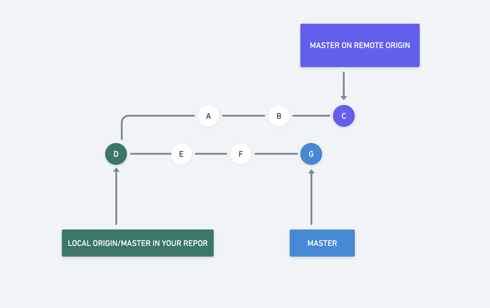
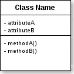
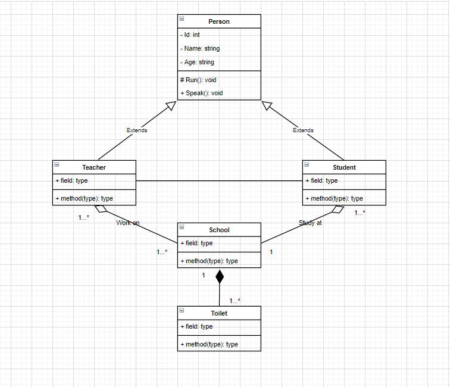
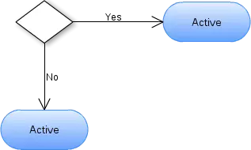
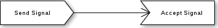

##Buổi 5 Dev thì không chỉ viết code
### Tìm hiểu về version control
1. Khái niệm:
   - Version control (VCS) là một loại phần mềm giúp chúng ta **quản lý sự thay đổi trong source code** của dự án theo thời gian một cách dễ dàng và thuận lợi.
2. Mục đích sử dụng
   - Do VCS **lưu trữ mọi sự thay đổi trong source code** của dự án trong một cơ sở dữ liệu đặc biệt nên chúng ta có thể dễ ràng **truy vấn ra được sự thay đổi của source code trong một file tại một thời điểm bất kỳ**. Và nếu cần chúng ta có thể dễ dàng đảo ngược source code trong file trở về một thời điểm trước đó. VCS đặc biệt hữu dụng trong các dự án lớn đòi hỏi sự tham gia của nhiều lập trình viên.
   - Ví dụ:
   Khi chúng ta phát triển các tính năng cho một phần mềm, mỗi thành viên được phân công để phát triển một feature. Khi có hai thành viên cũng hoàn thành xong thì khi chúng ta gộp code lại có thể xảy ra xung đột. Khi đó VCS sẽ giúp chúng ta kiểm tra tính năng đó đến từ ai và cho tính năng nào.
## Tìm hiểu về Git
1. Tổng quan:
   - Khái niệm: Git là một hệ thống quản lý phiên bản phân tán (Distributed Version Control System – DVCS), nó là một trong những hệ thống quản lý phiên bản phân tán phổ biến nhất hiện nay. Git cung cấp cho mỗi lập trình viên kho lưu trữ (repository) riêng chứa toàn bộ lịch sử thay đổi.
    - Cách hoạt động
      -  Git coi thông tin được lưu trữ là một tập hợp các snapshot – ảnh chụp toàn bộ nội dung tất cả các file tại thời điểm.
      -  Mỗi khi bạn “commit”, Git sẽ “chụp” và tạo ra một snapshot cùng một tham chiếu tới snapshot đó. 
    
2. Các khái niệm về git:
    - Repo: Repository hay được gọi tắt là Repo là nơi chứa tất cả những thông tin cần thiết để duy trì và quản lý các sửa đổi và lịch sử của toàn bộ project. Git có 2 loại là remote repository và local repository.
      - Local repo là repository bố trí trên máy local của lập trình viên, dành cho một người dùng sử dụng.
      - Remote repo là repository để chia sẻ giữa nhiều người và bố trí trên server chuyên dụng.
     
    - Branch: 
      - Các Branch (nhánh) đại diện cho các phiên bản cụ thể của một kho lưu trữ tách ra từ project chính của bạn.
      - Branch cho phép bạn theo dõi các thay đổi thử nghiệm bạn thực hiện đối với kho lưu trữ và có thể hoàn nguyên về các phiên bản cũ hơn.
        Ví dụ:
        ```
                A---B---C new_feature
                /
        D---E---F---G master
        ```
   - Checkout: lệnh trong Git để chuyển giữa các nhánh.
     Cấu trúc:
      ```
      $ git checkout <branch- name>
      ```
   - Commit: Hành động ghi lại sự thay đổi trong repository của bạn. Mỗi commit có commit message để giải thích commit này có sự thay đổi gì.
     Cấu trúc: 
     ```
     $ git commit
     ```
    - Merge: Một lệnh dùng để hợp nhất các chi nhánh độc lập thành một nhánh duy nhất trong Git.
      Cấu trúc:
      ```java
      $ git merge <branch-name>
      ```
    Ví dụ: Quá trình hợp nhất 2 nhánh master tip và stage tip để tạo ra merge commit.
    
    
    - Push: Hành động đưa nội dung của local_repo lên remote_repo. Push là cách bạn chuyển giao các commit từ local_repo của bạn lên remote_repo. Cấu trúc lệnh: 
      ```
      $ git push remote_name branch_name
      ```    
    - Pull: Pull requests thể hiện các đề xuất thay đổi cho nhánh chính. 
    Mô hình hoạt động:
    
    Giả sử, chúng ta có một repository gồm một nhánh chính (master branch) và một nguồn từ xa (remote origin). Git Pull sẽ tải xuống tất cả các thay đổi từ vị trí mà local và master chuyển hướng. Trong mô hình trên, vị trí tải xuống là E. Git Pull sẽ thực thi lệnh Git Fetch để “nạp” các remote commit được chuyển hướng tại A-B-C. Sau đó, local merge commit mới (H) được tạo ra có nội dung đồng bộ với các remote commit A-B-C.
    

    - Clone: Hành động thực hiện tải một bản sao có sẵn của một remote repository server nào đó (có thể là dự án bạn tham gia). Clone được sử dụng để tạo bản sao cục bộ của kho lưu trữ.
   Cú pháp: 
      ```
      $ git clone <:clone git url:>
      ```
   
        Ví dụ: `$ git clone git@github.com:hapo-nghialuu/tutorial.git`
    - Fork: Một fork là một bản copy của một repository (Kho chứa source code của bạn trên Github). Fork được sử dụng để tạo bản sao phía máy chủ.
3. Pull request:
    - Khái niệm: Pull request được tạo ra để đưa những file source code của bạn lên 1 host chung nơi mọi người có quyền truy cập sẽ truy cập vào và cùng review, để lại comment trên những file source code đó. 
    - Cách tạo pull request trong Github:
    - Bước 1: Fork dự án gốc.
       - Truy cập vào dự án gốc trên GitHub.
       - Nhấn vào nút “Fork” ở góc trên bên phải để sao chép dự án vào tài khoản của bạn.
    - Bước 2: Clone dự án về máy.
    - Bước 3: Tạo nhánh mới
       - Sử dụng lệnh `git checkout -b [tên_nhánh]` để tạo và chuyển đổi sang một nhánh mới.
    - Bước 4: Thực hiện thay đổi.
    - Bước 5: Commit và Push.
       - Sử dụng lệnh `git commit -m "Mô tả commit"` để commit các thay đổi đã thêm.
       - Sử dụng lệnh `git push origin [tên_nhánh]` để đẩy thay đổi lên repository của bạn trên GitHub.
    - Bước 6: Tạo Pull Request.
       - Truy cập vào repository của bạn trên GitHub.
       - Nhấn vào nút “Compare & pull request” bên cạnh tên nhánh của bạn.
       - Điền thông tin cần thiết, mô tả về Pull Request và nhấn “Create Pull Request“.
    - Bước 7: Kiểm tra xử lí và yêu cầu chỉnh sửa.
       - Nhóm quản lý dự án sẽ xem xét và thảo luận về Pull Request của bạn.
       - Nếu cần chỉnh sửa, bạn chỉ cần thêm commit vào nhánh đã tạo và Pull Request sẽ tự động cập nhật.
    - Bước 8: Pull Request được chấp nhận và merge
       - Sau khi Pull Request đạt yêu cầu, nhóm quản lý sẽ chấp nhận và merge vào nhánh chính.
       - Code của bạn đã được hợp nhất vào dự án gốc.
## Tìm hiểu về UML
1. Khái niệm:
   - Ngôn ngữ mô hình hóa thống nhất (tiếng Anh: Unified Modeling Language, viết tắt thành UML) là một ngôn ngữ mô hình gồm các ký hiệu đồ họa mà các phương pháp hướng đối tượng sử dụng để thiết kế các hệ thống thông tin một cách nhanh chóng.
2. Mục đích sử dụng:
    - Cung cấp cho người dùng một ngôn ngữ mô hình hóa trực quan sẵn sàng để sử dụng trong mọi hoàn cảnh. 
    - Cho phép phát triển và trao đổi những mô hình mang nhiều ý nghĩa.
    - Cung cấp khả năng mở rộng và chuyên môn hoá để mở rộng những khái niệm cốt lõi.
    - Độc lập với ngôn ngữ lập trình chuyên biệt và các tiến trình phát triển.
    - Cung cấp nền tảng về sự hiểu biết ngôn ngữ mô hình hoá.
    - Khuyến khích và hỗ trợ sự phát triển của các công cụ hướng đối tượng.
    - Hỗ trợ những khái niệm phát triển cấp độ cao như collaboration, framework, pattern and component.
    - Tích hợp một cách tốt nhất với thực tiễn.
3. Các mô hình:
    1. Class diagram (Biểu đồ lớp).
        - Định nghĩa:
           - Class diagram mô tả kiểu của các đối tượng trong hệ thống và các loại quan hệ khác nhau tồn tại giữa chúng.
           - Là một kỹ thuật mô hình hóa tồn tại ở tất cả các phương pháp phát triển hướng đối tượng.
           - Biểu đồ hay dùng nhất trong UML và gần gũi nhất với các lập trình viên.
           - Giúp các lập trình viên trao đổi với nhau và hiểu rõ ý tưởng của nhau.
           - Các thành phần của lớp.
          - Tên class.
          - Thuộc tính.
          - Phương thức.
          
        - Access Modifier trong class diagram.
          - Private ( - ): Chỉnh mình các đối tượng được tạo từ class này có thể sử dụng.
          - Public ( + ): Mọi đối tượng đều có thể sử dụng.
          - Protected ( # ): Chỉ các đối tượng được tạo từ class này và class - kế thừa từ class này có thể sử dụng.
          - Package/Default: Các đối tượng được tạo từ class trong lớp cùng gói có thể sử dụng.
        - Mối quan hệ giữa các lớp.
                
          - Inheritance: 1 class kế thừa từ 1 class khác.
          - Association: 2 class có liên hệ với nhau nhưng không chỉ rõ mối liên hệ.
          - Composition: Đối tượng tạo từ lass A mất thì đối tượng tạo từ class B sẽ mất.
          - Agreegation: Đối tượng tạo từ lass A mất thì đối tượng tạo từ class B vẫn tồn tại độc lập.
            Ví dụ:
            
        - Biểu diễn bội số quan hệ.
          - 1 : chính xác 1.
          - 0...1: 0 hoặc 1 
          - n : Bắt buộc có n
          - 0...* : 0 hoặc nhiều
          - 1...* : 1 hoặc nhiều
          - m...n: có tối thiểu là m và tối đa là n 
            
   1. Activity diagram (biểu đồ hoạt động)
        - Định nghĩa: 
          - Biểu đồ hoạt động là biểu đồ mô tả các bước thực hiện, các hành động, các nút quyết định và điều kiện rẽ nhánh để điều khiển luồng thực hiện của hệ thống.
          - Đối với những luồng thực thi có nhiều tiến trình chạy song song thì biểu đồ hoạt động là sự lựa chọn tối ưu cho việc thể hiện. 
          - Biểu đồ hoạt động tập trung mô tả các hoạt động và kết quả thu được từ việc thay đổi trạng thái của đối tượng.
        - Các thành phần:
          - Trạng thái khởi tạo hoặc điểm bắt đầu (Initial State or Start Point).
          
          - Trạng thái hoạt động (Activity or Action State).
          
          - Nút quyết định và rẽ nhánh.
          
          - Thanh đồng bộ.
            - Thanh đồng bộ kết hợp.
            
            - Thanh đồng bộ chia nhánh.
            
          - Cạnh gián đoạn (Interrupting Edge).
          
          - Luồng hoạt động (Action Folow)
          
          - Phân làn (Swimlanes).
          Phân làn trong biểu đồ sử dụng là những đường nét đứt thẳng đứng theo các đối tượng. Phần kí hiệu này thường được sử dụng để làm rõ luồng hoạt động của các đối tượng riêng biệt.
          - Thời gian sự kiện (Time Event).
          
          - Gửi và nhận tín hiệu (Sent and Received Signals).
          
          - Trạng thái kết thúc hoặc điểm cuối (Final State or End Point).
          
        - Ví dụ:
          - Biểu đồ hoạt động của một cây ATM.
           
          - Biểu đồ hoạt động của một quá trình đặt hàng.
          
