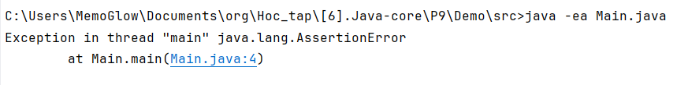
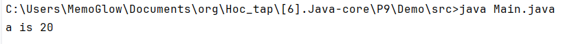

# Nhập xuất file, unit test.
## Xử lý file trong Java.
1. Xử lý file trong java.
    - Các class thường được sử dụng để xử lý file là:
        - **File**: thể hiện một file hoặc đường dẫn và cung cấp các phương thức để làm việc với file.
        - **FileInputStream** và **FileOutputStream**: Sử dụng để đọc ghi file nhị phân.
        - **FileReader** và **FileWriter**: Sử dụng để đọc ghi file dạng văn bản.
1. Các thao tác với file trong Java.
    1. Một số phương thức của class File.
        |Phương thức|Mô tả|
        |---|---|
        |createNewFiile()| Tạo file mới, Trả về true nếu file được tạo chưa tồn tại, trả về false nếu file được tạo đã được tạo|
        |canRead()|Kiểm tra khả năng đọc file|
        |canWrite()|Kiểm tra khả năng ghi file|
        |delete()|Xóa file|
        |exists()|Kiểm tra sự tồn tại của file
        - Một số ví dụ.
            - Tạo file.
            ```Java
            public class Main {
                public static void main(String[] args) {
                    File a = new File("test.txt");
                    try{
                        System.out.println(a.createNewFile());
                    }catch (IOException e){
                        System.out.println("Caught");
                    }
                }
            }
            ```
            ```Command prompt
            Output: // file test mới được tạo.
            true // nếu chưa có file test tồn tại.
            false // nếu file test đã tồn tại.
            ```
            - Xóa file.
            ```Java
            public class Main {
                public static void main(String[] args) {
                    File a = new File("test.txt");
                    System.out.println(a.delete());
                }
            }
            ```
            ```
            Output: //file test được xóa.//
            true // nếu có tồn tại file để xóa.
            false // nếu không tồn tại file để xóa.
            ```
    2. Đọc và ghi file trong Java.
        <!-- File nhị phân và file text được sử dụng khi nào. -->
        - File nhị phân.
            - Ta sử dụng class **FileInputStream** để đọc file.
            ```Java
            public class Main {
                public static void main(String[] args) {
                    try{
                        Scanner sc = new Scanner(new FileInputStream("test.txt"));
                        String s = sc.nextLine();
                        System.out.println(s);
                    }catch (FileNotFoundException e){
                        System.out.println("File khong ton tai");
                    }catch (NoSuchElementException e){
                        System.out.println("File khong co data");
                    }
                }
            }
            ```
            - Ta sử dụng class **FileOutputStream** để ghi file. Khi ghi file thì phải chuyển String sang default charset sử dụng hàm getBytes().
            ```Java
            public class Main {
                public static void main(String[] args) {

                    try{
                        FileOutputStream fw = new FileOutputStream("test.txt");
                        fw.write("1 2 3 4 5 6 7 8 9 10".getBytes());
                        Scanner sc = new Scanner(new FileReader("test.txt"));
                        System.out.println(sc.nextLine());
                        fw.close();
                    }catch (FileNotFoundException e){
                        System.out.println("File khong ton tai");
                    }catch (NoSuchElementException e){
                        System.out.println("File khong co data");
                    }catch (IOException e){
                        System.out.println(e);
                    }
                }
            }
            ```
        - File văn bản:
            - Ta sử dụng class **FileReader** để đọc file.
                |Phương thức|Tác dụng|
                |---|---|
                |close()|Đóng FileReader, được thực hiện sau cùng.|
                |read()|Đọc 1 hay nhiều ký tự từ file, trả về -1 nếu không còn gì để đọc|
            ```
            Nội dung file test.txt
            1 2 3 4 5 6 7 8 9 10 
            ```
            ```Java
            public class Main {
                public static void main(String[] args) {
                    try{
                        Scanner sc = new Scanner(new FileReader("test.txt"));
                        String s = sc.nextLine();
                        System.out.println(s);
                    }catch (FileNotFoundException e){
                        System.out.println("File khong ton tai");
                    }catch (NoSuchElementException e){
                        System.out.println("File khong co data");
                    }
                }
            }
            ```
            ```
            Output: 
            1 2 3 4 5 6 7 8 9 10
            ```
            - Ta sử dụng class **FileWriter** để ghi file.
                |Phương thức|Tác dụng|
                |---|---|
                |close()|Đóng FileReader, thường được sử dụng khi đã hoàn thành|
                |write()|Để ghi một chuỗi hoặc ký tự vào file|
            <!-- Tự tạo file thì không ghi được file, nhưng để máy tạo lại oke -->
            ```
            File test.txt không tồn tại.
            ```
            ```Java
            public class Main {
                public static void main(String[] args) {

                    try{
                        FileWriter fw = new FileWriter("test.txt");
                        fw.write("1 2 3 4 5 6 7 8 9 10");
                        Scanner sc = new Scanner(new FileReader("test.txt"));
                        System.out.println(sc.nextLine());
                        fw.close();
                    }catch (FileNotFoundException e){
                        System.out.println("File khong ton tai");
                    }catch (NoSuchElementException e){
                        System.out.println("File khong co data");
                    }catch (IOException e){
                        System.out.println(e);
                    }
                }
            }
            ```
            ```
            Output:
            1 2 3 4 5 6 7 8 9 10
            ```
## Assertions
- Tổng quan:
    - Câu lệnh Assertion giúp phát hiện lỗi bằng cách kiểm tra đoạn code mà người lập trình cho là đúng.
    - Ta có thể sử dụng Assertion trong Java bằng cách sử dụng từ kháo assert.
    - Khi thực thi assertion, mặc định sẽ được cho là đúng. Nếu sai thì JVM sẽ ném ra AssertionError.
- Cách sử dụng Assertions.
    - Cú pháp.
        ```Java
        assert expression;
        ```
        ```Java
        assert expression1 : expression2;
        ```
    - Thông thường, assertion thường bị tắt, để chạy được ta phải thực hiện câu lệnh trong terminal.
        Ta sử dụng cú pháp.         
        ```bash
        java -ea class-name.java
        ```
        - Ví dụ: đối với class Main.
        ```Java
        public class Main {
            public static void main(String[] args) {
                int a = 20;
                assert a <= 15;
                System.out.println("a is " + a);
            }
        }
        ```
        - Khi ta sử dụng Assertion.
        
        - Khi ta không sử dụng Assertion.
        
- Tác dụng của Assertions.
    - Đảm bảo các giả thiết trong comment là đúng.
    - Về cách sử dụng Assertions.
        - Nên sử dụng assertion ở.
            - Các đối số của hàm private. Các đối số này chỉ được cung cấp bởi lập trình viên và lập trình viên đó muốn kiểm tra các giả thiết của mình.
            - Các câu điều kiện.
            - Điều kiện tại phần mở đầu của các phương thức.
        - Lưu ý.
            - Không nên sử dụng Assertions để thay thế thông báo lỗi.
            - Không nên sử dụng để kiểm tra lỗi ở các phương thức public bởi chúng có thể gây ra do người dùng. Khi đó chúng ta nên để người dùng tự xử lý lỗi.
            - Assertions không nên sử dụng trên các tham số do người dùng nhập.
## Unit test.
- Khái niệm:
    - Trong kiểm thử phần mềm có 4 mức độ: Unit test ( kiểm thử mức đơn vị), Intergration test ( kiểm thử tích hợp), System test (kiểm thử hệ thống), Acceptance test (kiểm thử chấp nhận).
    - Unit test là mức độ kiểm thử nhỏ nhất trong quá trình trên. Unit test bao gồm kiểm thử method, class, module,...
    - Unit test được thực hiện bởi lập trình viên.
- Lợi ích của Unit test.
    - Viết Unit test tốt giúp tăng sự tin tưởng vào mã nguồn được thay đổi hoặc bảo trì.
    - Kiểm thử từng thành phần riêng rẽ của dự án mà không cần đợi các thành phần khác hoàn thành.
    - Dễ dàng khoanh vùng và sửa chữa do thực hiện kiểm thử trên từng đơn vị nhỏ và các module riêng rẽ.
    - Có thể tái sử dụng.
    - Chi phí cho Unit test ít hơn.
    - Mã nguồn tốt nếu viết Unit test tốt.
    
        


