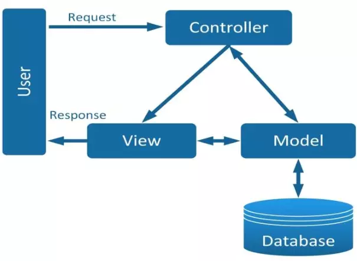

## Các nguyên tắc thiết kế, mô hình thiết kế
### SOLID.
1. **Single responsibility principle (SRP - Nguyên lý đơn chức năng).**
    - Nội dung: Một class chỉ nên giữ một trách nhiệm duy nhất, chỉ có thể sửa class với 1 lý do duy nhất.
    - Mô tả:
        - Nguyên tắc này giúp giảm độ phức tạp bởi khi chương trình trở nên lớn và phức tạp thì sẽ khó để nhớ các chi tiết hơn.
        - Chúng ta có thể thực hiện nguyên tắc này bằng cách chia nhỏ các class lớn thành nhiều class nhỏ.
    - Ví dụ về class Employee.
        ```Java
        class Employee{
            private String name;
            public String getName(){
                return name;
            }
            public void printTimeSheetReport(){
                // in ra báo cáo về thời gian.
            }
        };
        ```
        - Thay vì để cho Employee thực hiện phương thức printTimeSheetReport() thì chúng ta có thể chia phương thức này vào một class khác, ở đây là class Sheet.
        ```Java
        class Sheet{
            public static void print(Employee e){
                // in ra báo cáo thời gian.
            }
        };
        class Employee{
            private String name;
            public String getName(){
                return name;
            }
        };
        ```
1. **Open-Closed principle (OCP - nguyên lý đóng mở).**
    - Có thể thoải mái mở rộng một class nhưng không được sửa đổi bên trong class đó.
    - Mô tả.
        - Theo nguyên tắc này, chúng ta không được thay đổi hiện trạng của lớp có sẵn, nếu muốn thêm tính năng, thì ta sẽ mở rộng class cũ bằng cách kế thừa để xây dựng class mới.
        - Nguyên tắc này giúp duy trì được tính ổn định của chương trình bởi khi đó code sử dụng class nguồn sẽ được giữ nguyên, cách hoạt động của nó sẽ không đổi.
        - Tuy nhiên khi thực hiện nguyên tắc này cần lưu ý về ý nghĩa của các chức năng, tránh tạo ra quá nhiều class dẫn xuất.
    - Ví dụ về class Order.
        - #include
        ```Java
        class Order{
            public String shipping;
            public int total;
            public int getShippingCost(){
                if(shipping == "ground"){
                    if(total > 100){
                        return 0;
                    }
                    return total * 1.5;
                }
                else if(shipping == "air"){
                    return total * 3;
                }
            }
        };
        ```
        - Về phương thức shippingCost, để tính được shipping cost thì phải dựa trên cách thức ship và số lượng total.
        - Mỗi lần ta muốn thêm một cách thức mới thì ta sẽ bổ sung thêm if else tương ứng, điều này có thể làm mất sự ổn định của class.
        - Ta sẽ xây dựng lại phương thức getShippingCost() bằng cách tạo một interface Shipping, từ đó sẽ tạo ra các class Ground, Air để implement interface Shipping. Mỗi lần muốn mở rộng ta chỉ cần tạo ra một class mới và implement interface Shipping.
        ```Java
        class Order {
            public Shipping shipping;
            public int total;

            public void setTotal(int total) {
                this.total = total;
            }

            public void setShipping(Shipping shipping) {
                this.shipping = shipping;
            }

            public int getShippingCost() {
                return shipping.getCost(this);
            }
        }
        interface Shipping{
            int getCost(Order order);
            int getDate(Order order);
        }
        class Ground implements Shipping{
            public int getCost(Order order) {
                return 10 * order.total;
            }
            public int getDate(Order order) {
                return 0;
            }
        }
        class Air implements Shipping{
            public int getCost(Order order) {
                if(order.total < 10) return order.total * 10;
                else return 20 * order.total;
            }
            public int getDate(Order order) {
                return 0;
            }
        }
        public class Main{
            public static void main(String[] args) {
                Order order = new Order();
                order.setShipping(new Ground());
                order.setTotal(10);
                System.out.println(order.getCost());
            }
        };
        - VD2
        ``` Java
        class Animal{
            String name;
            int age;
            String type;
            public int getSpeed(){
                switch(type){
                    case "cheetah":
                        return 130;
                    case "lion":
                        return 80;
                    case "elephant":
                        return 40;
                    default:
                        return -1;
                }
            }
        }
        ```
        ```Java
        interface SpeedRate{
            int getSpeedRate(Animal animal);
        }
        class ElephantSpeedRate implements SpeedRate{
            @Override
            public int getSpeedRate(Animal animal) {
                return 40;
            }
        }
        class CheetahSpeedRate implements SpeedRate{
            @Override
            public int getSpeedRate(Animal animal) {
                return 130;
            }
        }
        class Animal{
            public String name;
            public int age;
            public SpeedRate speedRate;
            int getSpeedRate(){
                return speedRate.getSpeedRate(this);
            }
        }
        ```


1. **Liskov Substitution Principle.**
    - Nội dung: 
        - Trong một chương trình, các object của class con có thể thay thế class cha mà không làm thay đổi tính đúng đắn của chương trình. 
        - Khi ghi đè một phương thức, thì chúng ta nên mở rộng phương thức ban đầu thay vì thay thế nó bằng một phương thức hoàn toàn khác.
    - Một số yêu cầu:
        - Tham số trong class con nên bằng hoặc trừu tượng hơn so với tham số trong class cha.
        - Kiểu trả về của class con phải = hoặc là kiểu con của kiểu trả về của class cha.
        - Phương thức ở class con không nên ném ra ngoại lệ mà phương thức cha không có khả năng ném ra.
        - Class con không nên thu hẹp lại điều kiện ban đầu.
        - Class con không nên làm yếu đi điều kiện sau.
        - Các tính chất bất biến của class chả phải được giữ nguyên.
    - Ví dụ:
        - VD1:
            ```Java
            class Document{
                private String data;
                public void save(){
                    System.out.println("File saved");
                }
                public void open(){

                }
            }
            class ReadOnlyDocument extends Document{
                public void save(){
                    throw new RuntimeException("ReadOnlyDocument");
                }
            }
            ```
            - Ở đoạn code trên, ta đã thực hiện tạo class con ReadOnlyDocument kế thừa từ document. 
            - Khi thực hiện lệnh save Document bất kỳ thì sẽ ném ra ngoại lệ nếu nó là ReadOnlyDocument -> xung đột với class cha về phương thức save khi nó ném ra ngoại lệ mà class cha không ném ra được.
            - Ta sẽ thực hiện cấu trúc lại
            ``` Java
            class Document{
                private String data;
            }
            class WriteAbleDocument extends Document{
                public void save(){

                }
            }
            ```
            - Bằng cách sử dụng class WriteAbleDocument thì sẽ không còn xuất hiện mâu thuẫn như trên.
        - VD2: Giả sử ta có class Rectangle và class Square như bên dưới.
            ```Java
            class Rectangle{
                private int width;
                private int height;

                public void setWidth(int width) {
                    this.width = width;
                }

                public void setHeight(int height) {
                    this.height = height;
                }
                public int area(){
                    return width * height;
                }
            }
            class Square extends Rectangle{
                public void setWidth(int width) {
                    super.setWidth(width);
                    super.setHeight(width);
                }
                public void setHeight(int height) {
                    super.setHeight(height);
                    super.setWidth(height);
                }
            }
            public class Main{
                public static void main(String[] args) {
                    Rectangle rec = new Square();
                    rec.setHeight(4);
                    rec.setWidth(5);
                    System.out.println(rec.area());
                }
            };
            ```
            - Đoạn code trên đã vi phạm quy tắc bởi LSP bới hai phương thức setHeight và setWidth của class Square có cách thức thực hiện khác so với class Rectangle. 
            - Hệ quả là khi ta thực hiện phương thức Area như đoạn code trên thì sẽ xuất hiện kết quả không như mong muốn.
            - Chúng ta sẽ xử lí bằng cách tạo một interface Shape để Square và Rectangle implement.
            ```Java
            interface Shape{
                int area();
            }
            class Square implements Shape{
                private int size;

                public void setSize(int size) {
                    this.size = size;
                }

                @Override
                public int area() {
                    return size * size;
                }
            }
            class Rectangle implements Shape{
                private int width;
                private int height;

                public void setWidth(int width) {
                    this.width = width;
                }

                public void setHeight(int height) {
                    this.height = height;
                }

                @Override
                public int area() {
                    return width * height;
                }
            }
            ```

1. **Interface Segragation Principle**
    - Nội dung: 
        - Thay vì sử dụng một interface lớn, ta nên tách thành nhiều interface nhỏ, với nhiều mục đích cụ thể.
        - Chúng ta sẽ phải sắp xếp và phân chia interface một cách hợp lý.
    - Ví dụ:
        - Giả sử ta có một interface Conversion với các phương thức intToDouble(), intTochar() và charToString().
        ```Java
        public interface Conversion{
            public void intToDouble();
            public void intToChar();
            public void charToString();
        }
        ```
        - Interface trên có 3 method. Nếu ta chỉ muốn sử dụng phương thức intToChar thì ta buộc phải implement Conversion và override các phương thức còn lại. Để giải quyết vấn đề này, nguyên tắc này cho phép chúng ta chia interface thành 3 class khác.
        ```Java
        public interface ConvertIntToDouble{
            public void intToDouble();
        }
        public interface ConvertIntToChar{
            public void intToChar();
        }
        public interface convertCharToString{
            public void charToString();
        }
        ```
1. **Dependency Inversion**
    - Nội dung:
        - Các module cấp cao không nên phụ thuộc vào module cấp thấp. Cả 2 nên phụ thuộc vào abstraction.
        - Interface không nên phụ thuộc vào chi tiết, mà ngược lại. (Các class giao tiếp với nhau thông qua interface, không phải thông qua implementation.);/'
    - Yêu cầu:
        - Các chi tiết nên phụ thuộc vào những cái trừu tượng. Tức là những thành phần cấp cao không nên phụ thuộc vào thành phần cấp thấp.
        - Mỗi sự phụ thuộc trong thiết kế nên nhắm đến một interface hay abstract class chứ không phải một class rõ ràng.


    - Ví dụ:
        - VD1.
            ```Java
            class Data{
                ArrayList<String> nameList;
                public  boolean findUserByName(String name){
                    for(String  data : nameList){
                        if(data.equals(name)) return true;
                    }
                    return false;
                }
            }
            class UserSevice{
                Data data;
                boolean authenticateUserName(String userName){
                    boolean validUserName = data.findUserByName(userName);
                }
            }
            ```
            - Trong ví dụ trên, class UserService phụ thuộc trực tiếp vào class Data.
            - Khi class Data có thay đổi thì ta cũng sẽ phải chỉnh sửa class UserService,  vi phạm quy tắc DIP.
            - Để giải quyết ta sẽ làm cho class UserService sẽ phụ thuộc vào interface Data. Bên cạnh đó ta cũng sẽ tạo một class Data khác implement từ class Data.
            ```Java
            class GlobalData implements Data{
                public boolean findUserByName(String name) {
                    return true;
                }
            }
            interface Data{
                boolean findUserByName(String name);
            }
            class UserSevice{
                Data data;  
                boolean authenticateUser(String userName, String password){
                    boolean validUserName = data.findUserByName(userName);
                    if(validUserName == false) return false;
                    // Xử lý tiếp
                    return true;
                }
            }
            ```
            - Khi đó class UserService sẽ phụ thuộc vào interface Data thay vì một class rõ ràng là Data.
        - VD2:
            ```Java
### KISS, DRY và YAGNI.
1. **KISS - "Keep it simple, stupid".**
    - Nội dung: hầu hết những hệ thống hoạt động tốt nếu chúng giữ được sự đơn giản hơn là làm cho chúng phức tạp, sự đơn giản là mục tiêu chính và để thiết kế và sự phức tạp là không cần thiết và nên tránh.
2. **DRY - "Don't Repeat Yourself"**
    - Nội dung: Mỗi một phần kiến thức phải độc lập, rõ ràng, căn cứ đại diện cho một hệ thống. Nói cách khác, ban phải cố gắng duy trì hành vi của một chức năng trong hệ thống với một đoạn code duy nhất.
    - Khi nguyên tắc DRY không được tuân theo, điều này được gọi là những giải pháp WET, viết tắt của từ "Write Everything Twice" hoặc "We enjoy typing".
3. **YAGNI - "You aren't gonna need it"**
    - Nội dung: đó là một câu khẩu ngữ nhằm nhắc nhở người lập trình trong quy trình Extreme Programming (lập trình cực hạn) thì: "Chưa phải lúc cần thiết thì chưa được phép làm.
### Mô hình MVC.
1. **Khái niệm.**
    - MVC là viết tắt của cụm từ “Model-View-Controller“, đây là mô hình thiết kế được sử dụng trong kỹ thuật phần mềm.
    - MVC là một mẫu kiến trúc phần mềm để tạo lập giao diện người dùng trên máy tính.
    - MVC chia thành ba phần được kết nối với nhau và mỗi thành phần đều có một nhiệm vụ riêng của nó và độc lập với các thành phần khác.
    - MVC được sử dụng roognj rãi trong phát triển Web.
    
1. Các thành phần trong MVC.
    - Model:
        - Có nhiệm vụ thao tác với Database.
        - Nó chứa tất cả hàm, các phương thức truy vấn trực tiếp với dữ liệu.
        - Controller sẽ thông qua các hàm, phương thức đó để lấy dữ liệu rồi gửi qua view.
    - View:
        - Là giao diện người dùng (User Interface).
        - Chưa các thành phần tương tác với người dùng như button, image, text,...
        - Nơi nhận dữ liệu từ Controller để hiển thị.
    - Controller:
        - Là thành phần trung gian giữa Model và View.
        - Đảm nhận vai trò tiếp nhận yêu cầu từ người dùng thông qua Model để lấy dữ liệu sau đó thông qua View để hiển thị cho người dùng.
1. Luồng xử lý trong MVC.
    - Đầu tiên là Request từ người dùng gửi từ Client đến server.
    - Sau đó Controller dựa vào yêu cầu của người dùng tiến hành giao tiếp với MOdel để lấy data từ database.
    - Cuối cùng Controller gửi dữ liệu vừa lấy được về view và hiển thị ra cho người dùng trên trình duyệt.


        
        
