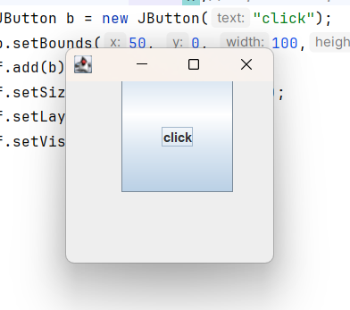

# Thư viện đồ họa Swing.
## Thư viện đồ họa Swing cơ bản.
- Cấu trúc của Java Swing.

- Một số phương thức thường sử dụng của các class thành phần.
|Phương thức|Mô tả|
|---|---|
|public void add(Component c)| thêm một thành phần trên thành phần khác|
|public void setSize(int width, int height)| đặt kích thước cho thành phần|
|public void setLayout(LayoutManager m)| Đặt layout manager cho thành phần|
|public void setVisible(boolean b)| Đặt khả năng nhìn thấy của thành phần. Mặc định là false|
- Một số ví dụ cơ bản:
    ```Java
    public class Main{
        public static void main(String[] args) {
            JFrame f = new JFrame();// tạo thể hiện của JFrame
            JButton b = new JButton("click");
            b.setBounds(50, 0, 100,100);
            f.add(b);
            f.setSize(200, 200);
            f.setLayout(null);
            f.setVisible(true);
        }
    }
    ```
    
## Các lớp trong Java Swing.
- **Lớp JFrame.**
    - JFrame trong Java được sử dụng để tạo và quản lý cửa sổ trên cùng trong ứng dụng Java. 
    - Một số phương thức JFrame thường dùng:
        |Phương thức|Mô tả|
        |---|---|
        |setTitle(String title)| Chèn title|
        |setSize(int width, int height)| Đặt kích thước|
        |setVisible(boolean b)| Đặt khả năng ẩn hiện của JFrame|
        |setLayout(LayoutManager manager)| Đặt trình quản lý layout cho JFrame|
        |add (Component comp)| Thêm thành phần Swing cho JFrame (JButton, ...)|
        |remove (Component comp)| Xóa bỏ thành phần|
        |setDefaultCloseOperation(int operation)| Đặt trạng thái đóng mặc định cho JFrame|
    - Một số trường của Java JFrame:
        |Trường|Mô tả|
        |---|---|
        |EXIT_ON_CLOSE (int)|Thao tác đóng mặc định khi người dùng đóng JFrame|
        |DISPOSE_ON_CLOSE (int)|Sắp xếp lại JFrame nhưng không đóng ứng dụng|
        |HIDE_ON_CLOSE (int)|Ẩn JFrame khi người dùng đóng JFrame|
        |DO_NOTHING_ON_CLOSE (int)|Không làm gì cả khi người dùng đóng JFrame||
-   **Lớp JButton.**
    - Một số Constructor:
        |Constructor|Mô tả|
        |---|---|
        |JButton()|Tạo một button mà không thiết lập text hoặc icon|
        |JButton(Action a)|Tạo một button tại đây các thuộc tính được nhận từ Action đã cung cấp|
        | JButton(Icon icon)|Tạo một button với một icon|
        |JButton(String text)|Tạo một button với text|
        |JButton(String text, Icon icon)|Tạo một button với text ban đầu và một icon.|
    - Một số phương thức phổ biển:
        |Phương thức| Mô tả|
        |---|---|
        |void removeNotify()| Ghi đè JComponent.removeNotify để kiểm tra xem button này hiện tại được thiết lập như là button mặc định trên RootPane hay không, và nếu có, thiết lập button mặc định của RootPane về null để bảo đảm rằng Rootpane không giữ một tham chiếu button không hợp lệ.|
        |void setDefaultCapable(boolean defaultCapable)|Thiết lập thuộc tính defaultCapable, mà quyết định xem có hay không button này có thể được tạo là button mặc định cho Root Pane của nó|
        | void updateUI()|Phục hồi thuộc tính UI về một giá trị từ L&F hiện tại|
        |public void setText(String s)|được sử dụng để thiết lập text đã cho trên button|
        |public String getText()|được sử dụng để kích hoạt hoặc vô hiệu hóa button|
        |public void setIcon(Icon b)| thiết lập Icon đã cho trên button|
        |public void addActionListener(ActionListener a)|thêm action listener tới đối tượng này|
- Lớp **JLabel**
    - Một số constructor:
        |Constructor|Mô tả|
        |---|---|
        |JLabel()|Tạo một instance của JLabel, không có hình ảnh, và với một chuỗi trống cho title.|
        | JLabel(Icon image)|Tạo một instance của JLabel với hình ảnh đã cho.|
        | JLabel(Icon image, int horizontalAlignment)|Tạo một instance của JLabel với hình ảnh và căn chỉnh ngang đã cho.|
        |JLabel(String text)|Tạo một instance của JLabel với text đã cho.
        | JLabel(String text, Icon icon, int horizontalAlignment)|Tạo một instance của JLabel với text, hình ảnh, và căn chỉnh ngang đã cho.
        |JLabel(String text, int horizontalAlignment)|Tạo một instance của JLabel với text và căn chỉnh ngang đã cho.|
    - Một số phương thức:
        |Phương thức|Mô tả|
        |---|---|
        |void setDisabledIcon(Icon disabledIcon)|Thiết lập icon để được hiển thị nếu JLabel này là "disabled" (JLabel.setEnabled(false))|
        |void setDisplayedMnemonic(char aChar)|Xác định displayedMnemonic như là một giá trị char|
        |void setDisplayedMnemonic(int key)|Xác định keycode mà chỉ dẫn một mnemonic key|
        |void setDisplayedMnemonicIndex(int index)|Cung cấp một hint cho L&F, từ đó ký tự trong text nên được trang trí để biểu diễn mnemonic|
        |void setHorizontalAlignment(int alignment)|Thiết lập sự căn chỉnh nội dung của label theo trục X|
        |void setHorizontalTextPosition(int textPosition)|Thiết lập vị trí theo chiều ngang của phần text của label, cân xứng với hình ảnh của nó|
        |void setIcon(Icon icon)|Định nghĩa icon mà thành phần này sẽ hiển thị|
        |void setIconTextGap(int iconTextGap)|Nếu cả hai thuộc tính icon và text được thiết lập, thuộc tính này xác định khoảng trống giữa chúng|
        |void setLabelFor(Component c)|Thiết lập thành phần đang gán nhãn cho|
        |void setText(String text)|Định nghĩa trường text dòng đơn mà thành phần này sẽ hiển thị|
        |void setUI(LabelUI ui)|Thiết lập đối tượng L&F mà biểu diễn thành phần này|
        |void setVerticalAlignment(int alignment)|Thiết lập sự căn chỉnh nội dung của label theo trục Y|
        |void setVerticalTextPosition(int textPosition)|Thiết lập vị trí theo chiều dọc của phần text của label, cân xứng với hình ảnh của nó|
        |void updateUI()|Phục hồi thuộc tính UI về một giá trị từ L&F hiện tại|