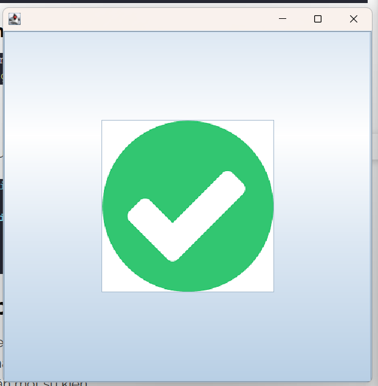

# Thư viện đồ họa Swing.
## Thư viện đồ họa Swing cơ bản.
- Khái niệm: Java Swing là một phần của Java Foundation Class (JFC) được sử dụng để tạo ccacs ứng dụng window-based. Nó được xây dựng trên API AWT (Abstract Windowing Toolkit) và được viết hoàn toàn bằng Java.
- JFC là một bộ các thành phần GUI đơn giản hóa sự phát triển của các ứng dụng desktop.
- Phân cấp các lớp Java Swing.

- Một số phương thức thường dùng:
    - public void add(Component c): thêm một thành phần vào thành phần khác.
    - public void setSize(int width, int height): thiết lập kích thước của thành phần.
    - public void setLayout(LayoutManager m): thiết lập trình quản lý bố cục cho thành phần.
    - public void setVisible(boolean b): thiết lập khả năng hiển thị của thành phần. Mặc định là false (ẩn).
    - Ví dụ:
    ```Java 
    public class Main {
        public static void main(String[] args) {
            JFrame frame = new JFrame();
            frame.setSize(350, 200);
            frame.setTitle("Day la vi du");
            JButton button = new JButton();
            button.setText("Click vao vi du");
            button.setBounds(50, 50, 200, 50);
            frame.add(button);
            frame.setLayout(null);
            frame.setVisible(true);
        }
    }
    ```
    
## JFrame, JButton, JLabel, JTextField, JTable, JList
### JFrame
- Lớp JFrame là một container trong ứng dụng Java Swing, nó được dùng để chứa và sắp xếp các thành phần con như Button, Label, TextField. 
- Các thao tác với JFrame.
    - Tạo một JFrame.
    - Chiều cao, chiều rộng và vị trí của JFrame trên Desktop.
        - setSize(width, height): Chỉ định chiều rộng vào chiều cao của JFrame
        - setLocation(int x, int y): Chỉ định toạ độ của JFrame trên màn hình theo 2 trục X, Y
        - setBounds(int x, int y, int width, int height): Cách sử dụng nhanh, gộp 2 hàm ở trên lại thành 1.
    - Cấu hình kích thước JFrame.
        - Sử dụng phương thức setExtendedState() với các tùy chọn sau:
            - NORMAL: Hiển thị kích thước thông thường
            - ICONIFIED: Hiển thị kích thước thu nhỏ
            - MAXIMIZED_HORIZ: Hiển thi với kích chiều rộng đạt kích thước tối đa
            - MAXIMIZED_VERT: Hiển thi với kích chiều cao đạt kích thước tối đa
            - MAXIMIZED_BOTH: Hiển thị với kích thước chiều cao và chiều rộng đạt kích thước tối đa
    - Cài dặt LayoutManager cho JFrame.
        - Sử dụng phương thức setLayout();
    - Thêm các component con vào JFrame.
        - Sử dụng phương thức add().
    - Xử lý khi JFrame bị đóng.
        - Sử dụng phương thức setDefaultCloseOperation(action e) cùng một số tham số sau.
            - DO_NOTHING_ON_CLOSE– Không làm thêm bất cứ điều gì khi JFrame bị đóng
            - HIDE_ON_CLOSE – JFrame sẽ bị ẩn đi khi người dùng đóng nó lại. Chương trình vẫn sẽ hoạt động bình thường trong khi JFrame này bị ẩn. Đây là một hành động mặc định của JFrame.
            - DISPOSE_ON_CLOSE – Sau khi bị đóng lại, nó đồng thời sẽ bị dọn dẹp rác, các tài nguyên được JFrame này sử dụng sẽ bị thu hồi nhường chỗ cho những nơi khác sử dụng.
            - EXIT_ON_CLOSE – Sau khi JFrame bị đóng, chương trình cũng sẽ tắt theo.
    - Xử lý sự kiện trong JFrame.
        - Ta có thể thêm ActionListener vào JFrame để nhận các thông báo những thay đổi trạng thái của chúng.
        - Mọt số sự kiện cơ bản:
            - windowOpened – Lúc JFrame mới mở lên
            - windowClosed – JFrame bị đóng lại
- Ví dụ:
    ```Java
    public class Main {
        public static void main(String[] args) {
            JFrame f = new JFrame();
            f.setSize(500, 500);
            f.setLocation(250, 250);
            JButton button = new JButton("Day la button");
            button.setSize(50, 50);
            f.add(button);
            f.setVisible(true);
        }
    }
    ```
### JButton
- Button là một control được sử dụng nhiều trong Java.
- Các thao tác với JButton.
    - Tạo Button.
    - Tạo Button và xử lý sự kiện.
    - Tạo Button với Icon.
        ```Java
        public class Main {
            public static void main(String[] args) {
                JFrame f = new JFrame();
                f.setSize(500, 500);
                f.setLocation(250, 250);
                JButton button = new JButton("Edit");
                button = new JButton(new ImageIcon("download.png"));
                f.add(button);
                f.setVisible(true);
            }
        }
        ```
        
    - Xử lý sự kiện trong Button.
        ```Java
        public class Main {
            public static void main(String[] args) {
                JFrame f = new JFrame("Vi du ve button");
                f.setLayout(new FlowLayout());
                f.setLocation(50, 50);
                f.setSize(500, 500);
                f.setDefaultCloseOperation(WindowConstants.EXIT_ON_CLOSE);
                JButton button = new JButton("Click");
                f.add(button);
                button.setBounds(10, 10, 10, 10);
                JLabel label = new JLabel("Chua duoc click");
                f.add(label);
                button.addActionListener(new ActionListener() {
                    @Override
                    public void actionPerformed(ActionEvent e) {
                        label.setText("Da duoc Click");
                        label.setVisible(true);
                    }
                });
                f.setVisible(true);
            }
        }
        ```
        
        
    - Tạo phím tắt, ghi nhớ cho Button.
        - Sử dụng phương thức setMnemonic()
        ```Java
        button.setMnemonic(KeyEvent.VK_E);
        ```
        ``` Java
        String mapKey = "KEY_F2";
        InputMap inputMap = button.getInputMap(JComponent.WHEN_IN_FOCUSED_WINDOW);
        inputMap.put(KeyStroke.getKeyStroke("F2"), mapKey);
        
        button.getActionMap().put(mapKey, new AbstractAction() {
            public void actionPerformed(ActionEvent evt) {
                buttonActionPerformed(evt);
            }
        });
        ```
    - Tùy biến giao diện Button.
        - Sử dụng phương thức setBackground(), setFont();
### JLabel
- JLabel có thể hiển thị text hoặc hình ảnh hoặc cả hai.
- Các thao tác với JLabel.
    - Tạo Label.
    - Mnemonic Key.
        ```Java
        import java.awt.BorderLayout;
        import javax.swing.JFrame;
        import javax.swing.JLabel;
        import javax.swing.JTextField;

        public class Main {
        public static void main(String[] args) {
            JFrame frame = new JFrame("JFrame");
            frame.setDefaultCloseOperation(JFrame.EXIT_ON_CLOSE);

            JTextField nameTextField = new JTextField();
            JLabel nameLabel = new JLabel("Name:");
            nameLabel.setDisplayedMnemonic('N');
            nameLabel.setLabelFor(nameTextField);

            frame.add(nameLabel, BorderLayout.WEST);
            frame.add(nameTextField, BorderLayout.CENTER);

            frame.pack();
            frame.setVisible(true);
        }
        }
        ```
    - Label với HTML.
    - Căn chỉnh văn bản.
        ```Java
        label.setHorizontalAlignment(JLabel.CENTER);
        label.setVerticalAlignment(JLabel.CENTER);
        ```
    - Tạo Border.
        - Sử dụng phương thức createLineBorder();
    - Vô hiệu hóa Label.
        - Sử dụng phương thức setEnabled();
### JTextField
- JTextField là component cho phép nhập và chỉnh sửa đoạn văn bản trên cùng một dòng.
- Các thao tác với JTextField.
    - Tạo JTextField.
        ```Java
        public class Main {
            public static void main(String[] args) {
                JFrame frame = new JFrame("JFrame");
                frame.setSize(400, 400);
                frame.setLocation(100, 100);
                JTextField jTextField = new JTextField();
                jTextField.setSize(100, 100);
                frame.add(jTextField);
                frame.setDefaultCloseOperation(WindowConstants.EXIT_ON_CLOSE);
                frame.setVisible(true);
            }
        }
        ```
    - Lấy String trong JTextField.
        - Sử dụng phương thức getText() của JTextField sẽ trả về String.
    - Tạo Tooltip trong JTextField.
        - Đôi khi đoạn văn bản của chúng ta quá nhiều và không thể hiển thị đầy đủ trên JTextField, hay bạn muốn hiển thị một thông điệp gì đó khi người dùng rê chuột vào một JTextField thì các bạn có thể sử dụng setToolTipText() method.
    - Focus vào một JTextField.
        - Thông thường JTextField sẽ ở trạng thái khi người dùng nhấp chuột vào đó, tuy nhiên chúng ta vẫn có thể xử lý chuyện này với code thông qua requestFocusInWindow() method.
    - Xử lý sự kiện trong JTextField.
    - Select các ký tự trong JTextField.
- Ví dụ:
    ```Java
    public class Main {
        public static void main(String[] args) {
            JFrame f = new JFrame("Nhap ten cua ban");
            f.setLayout(new FlowLayout());
            f.setSize(200, 200);
            f.setLocation(50, 50);
            f.setDefaultCloseOperation(WindowConstants.EXIT_ON_CLOSE);

            JLabel enterName = new JLabel("Vui long nhap ten cua ban");
            JLabel showName = new JLabel("Tên của bạn là: ");
            JTextField nameField = new JTextField(10);
            JButton button = new JButton("Enter");
            button.addActionListener(new ActionListener() {
                @Override
                public void actionPerformed(ActionEvent e) {
                    showName.setText("Tên của bạn là: " + nameField.getText());
                    showName.setVisible(true);
                }
            });
            f.add(enterName);
            f.add(nameField);
            f.add(button);
            f.add(showName);
            f.setVisible(true);
        }
    }
    ```
    
    
### JTable
- JTable được sử dụng để hiển thị và chỉnh sửa dữ liệu kiểu dạng Table.
- Một số thao tác trong JTable.
    - Khởi tạo và tùy biến JTable.
        - addColumn(TableColumn column) – Thêm một cột vào cuối bảng.
        - editCellAt(int row, int col) – Chỉnh sửa ô giao nhau của cột số col và hàng số row, nếu các chỉ số đã cho hợp lệ và ô tương ứng có thể chỉnh sửa được.
        - setValueAt(Object value, int row, int col) – Cập nhật giá trị tạo ô có số cột là col và hàng row thành giá trị value mới. 
        - clearSelection() – Bỏ chọn tất cả các cột và hàng trước đó đã được chọn.
    - Sắp xếp trong JTable.
    - Filter trong JTable.
- Ví dụ:
    ```Java
    public class Main {
        public static void main(String[] args) {
            JFrame f = new JFrame("Bang");
            f.setDefaultCloseOperation(WindowConstants.EXIT_ON_CLOSE);
            f.setSize(300, 300);
            f.setLocation(50, 50);
            f.setLayout(new FlowLayout());
            String[][] data = {{"Hiep", "18", "TG"}, {"Khong phai Hiep", "0", "Nowhere"}};
            String[] column = {"Name", "Age", "Location"};
            JTable table = new JTable(data, column);
            table.setAutoResizeMode(JTable.AUTO_RESIZE_ALL_COLUMNS);
            table.setVisible(true);
            f.add(table);
            f.setVisible(true);
        }
    }
    ```
    
### JList
- Jlist được sử dụng để hiển thị một tập hợp các phần tử và cho phép người dùng có thể chọn hoặc nhiều phần tử trong số chúng.
- Một số thao tác trong JList.
    - Tạo JList đơn giản.
    - Xử lý sự kiện trong JList.
    - Tạo JList Scroll trong Java Swing.
    - Multiple select trong JList.
    - Custom JList để hiện thị một Object.
    - Tạo JList với các phần tử là checkbox.
- Ví dụ:
    ```Java
    public class Main {
        public static void main(String[] args) {
            JFrame f = new JFrame("Danh sach");
            f.setDefaultCloseOperation(WindowConstants.EXIT_ON_CLOSE);
            
            String[] status = {"Ngủ", "Không ngủ", "Không Không Ngủ", "Không Không Không ngủ"};
            JList list = new JList(status);
            list.setVisibleRowCount(3);
            f.add(list);

            list.addListSelectionListener(new ListSelectionListener() {
                @Override
                public void valueChanged(ListSelectionEvent e) {
                    list.setSelectionBackground(Color.yellow);
                    list.setVisible(true);
                }
            });

            JScrollPane scroll = new JScrollPane(list);
            f.add(scroll, BorderLayout.NORTH);
            list.setFixedCellHeight(25);
            list.setSize(100, 100);
            list.setFixedCellWidth(100);
            
            f.setSize(300, 300);
            f.setLocation(50, 50);
            f.setVisible(true);
        }
    }
    ```
    
### Chương trình hiển thị ngày giờ hiện tại.
```Java
public class Main {
    public static void main(String[] args) {
        JFrame f = new JFrame("Thời gian hiện tại");
        f.setDefaultCloseOperation(WindowConstants.EXIT_ON_CLOSE);

        JLabel label = new JLabel("Thời gian hiện tại là: " + (new java.util.Date()).toString());
        label.setHorizontalAlignment(SwingConstants.CENTER);
        f.add(label, BorderLayout.CENTER);

        JButton button = new JButton("Cập nhật thời gian");
        f.add(button, BorderLayout.SOUTH);
        button.addActionListener(new ActionListener() {
            @Override
            public void actionPerformed(ActionEvent e) {
                label.setText("Thời gian hiện tại là: " + (new java.util.Date()).toString());
                label.setVisible(true);
            }
        });

        f.setLocation(50, 50);
        f.setSize(300, 300);
        f.setVisible(true);
    }
}
```

## BorderLayout, FlowLayout, GridLayout
### BorderLayout.
- BorderLayout tổ chức các thành phần con thành 5 vùng NORTH, SOUTH, EAST, WEST and CENTER. Ở mỗi vùng chỉ có thể chứa tối đa một thành phần con, khi thêm các phần tử khác nhau vào BorderLayout bạn cần chỉ định 1 trong 5 vùng trên.

### FlowLayout.
- FlowLayout bố trí các thành phần con theo hướng từ trái sang phải hoặc từ phải sang trái trên cùng một dòng. Nếu tất cả các thành phần con không thể chứa trên cùng một dòng so với chiều dài tối đa của container thì chúng sẽ được sắp xếp trên một hàng mới.
```Java
public class Main {
    public static void main(String[] args) {
        JFrame f = new JFrame("Các nút");
        f.setDefaultCloseOperation(WindowConstants.EXIT_ON_CLOSE);
        f.setLayout(new FlowLayout());
        JButton b1 = new JButton("b1");
        JButton b2 = new JButton("b2");
        JButton b3 = new JButton("b3");
        f.add(b1);
        f.add(b2);
        f.add(b3);
        f.setLocation(50, 50);
        f.setSize(300, 300);
        f.setVisible(true);
    }
}
```


### GridLayout.
- GridLayout được sử dụng để bố trí các thành phần trong một lưới hình chữ nhật, lưới này đã được chia thành các hình chữ nhật có kích thước bằng nhau và một thành phần được đặt trong mỗi hình chữ nhật. 
```Java
public class Main {
    public static void main(String[] args) {
        JFrame f = new JFrame("Các nút");
        f.setDefaultCloseOperation(WindowConstants.EXIT_ON_CLOSE);
        f.setLayout(new GridLayout(2, 2));
        JButton b1 = new JButton("b1");
        JButton b2 = new JButton("b2");
        JButton b3 = new JButton("b3");
        f.add(b1);
        f.add(b2);
        f.add(b3);
        f.setLocation(50, 50);
        f.setSize(300, 300);
        f.setVisible(true);
    }
}
```

## Graphics2D, Image.
### Graphics2D.
- là lớp trừu tượng kế thừa từ lớp Graphics, hỗ trợ nhiều công cụ để vẽ và xuất ra hình ảnh, văn bản… trên hình dạng 2 chiều
- Được sử dụng trong việc ghi đè phương thức paint(đối với container) và paintComponent(đối với component). Khi này ta có thể thiết kế để thành phần nhìn đẹp mắt hơn
```Java
class DrawingPanel extends JPanel{
    @Override
    protected void paintComponent(Graphics g) {
        super.paintComponent(g);
        Graphics2D g2d = (Graphics2D) g;
        Rectangle2D rect = new Rectangle2D.Double(100, 100, 100, 100);
        g2d.draw(rect);
    }
}
public class Main {
    public static void main(String[] args) {
        JFrame f = new JFrame("Demo");
        f.setSize(300, 300);
        f.setDefaultCloseOperation(WindowConstants.EXIT_ON_CLOSE);
        f.add(new DrawingPanel());
        f.setVisible(true);
    }
}
```

### Image 
- là lớp trừu tượng cha cho tất cả các lớp dùng để hiển thị hình ảnh như BufferedImage, ImageIcon…

