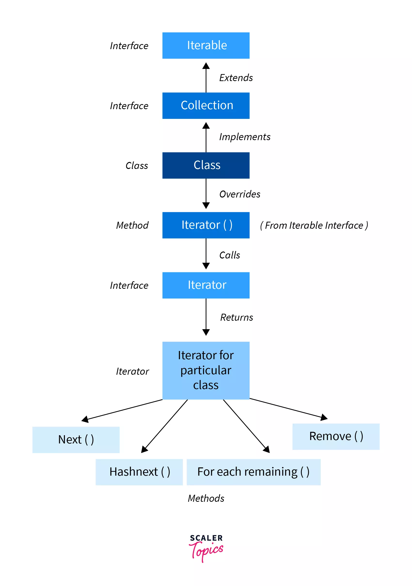

<!-- Cấu trúc dữ liệu là gì, sử dụng khi nào?
Interface Iterable, Collection -> List, Set, Queue.
Interface Map, SortedMap -> HashMap, TreeMap.
Sử dụng một số hàm của cấu trúc dữ liệu như sort. -->
<!-- Framework trong java là phần thân của những đoạn code được viết sẵn mà chúng ta có thể thêm code vào để giải quyết vấn đề. Chúng ta có thể sử dụng framework bằng cách gọi các phương thức, kế thừa, callbacks, listener or other implementations of the Observer pattern. -->
## 1. Cấu trúc dữ liệu trong Java.
   - Cấu trúc dữ liệu là cách mà chúng ta sắp xếp, thao tác, truy cập, và lưu trữ dữ liệu.
   - Cấu trúc dữ liệu có nhiều dạng đơn giản và phức tạp, thường được sử dụng để tổ chức dữ liệu tùy theo cách sử dụng nhất định.
   - Cấu trúc dữ liệu giúp chúng ta truy cập và sử dụng dữ liệu một cách dễ dàng hơn.
   - 
## 2. Interface iterable, Collection.
  1. Iterable interface:
   - Tổng quan:
     - Iterable interface trong Java cung cấp cho chúng ta khả năng duyệt qua các phần tử của Collection một cách tuần tự.
     - Các phần tử của collections như mảng, sets, queues, maps,... cũng có thể duyệt qua một cách dễ dàng sử dụng iterable interface.
     - Bằng cách sử dụng **iterator**, chúng ta có thể truy cập các phần tử trong collection. 
   - Về Iterator và Iterable:
     - Mỗi class mà implement interface Iterable đều được ghi đè phương thức Iterator(). 
     - Phương thức Iterator này gọi Interface iterator và trả về Iterator. 
     - Iterator được sử dụng để duyệt qua các object của class.
     - Các phương thức của Iterator.

      
   - 
## 3. Interface Map, SortedMap.
      | Left-Aligned  | Center Aligned  | Right Aligned |
      | :------------ |:---------------:| -----:|
      | col 3 is      | some wordy text | $1600 |
      | col 2 is      | centered        |   $12 |
      | zebra stripes | are neat        |    $1 |