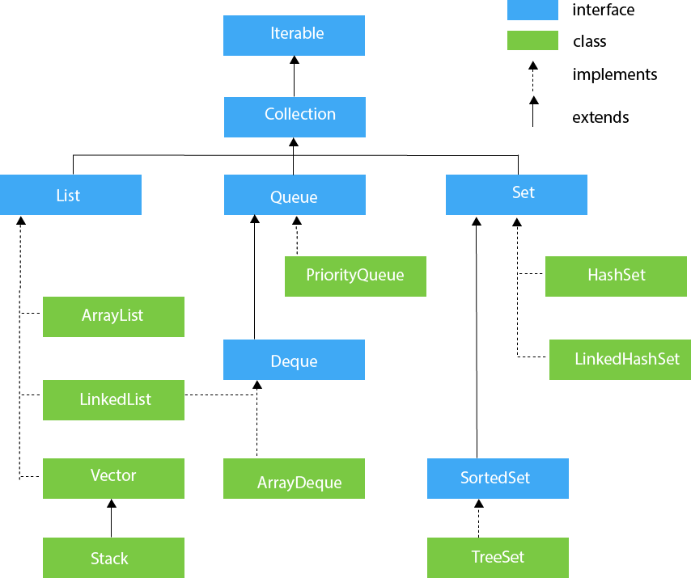
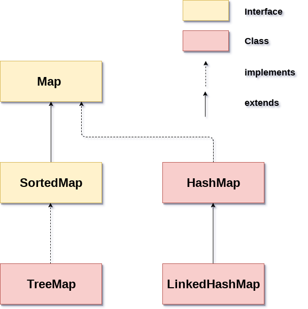

<!-- Cấu trúc dữ liệu là gì, sử dụng khi nào?
Interface Iterable, Collection -> List, Set, Queue.
Interface Map, SortedMap -> HashMap, TreeMap.
Sử dụng một số hàm của cấu trúc dữ liệu như sort. -->
<!-- Framework trong java là phần thân của những đoạn code được viết sẵn mà chúng ta có thể thêm code vào để giải quyết vấn đề. Chúng ta có thể sử dụng framework bằng cách gọi các phương thức, kế thừa, callbacks, listener or other implementations of the Observer pattern. -->
## 1. Cấu trúc dữ liệu trong Java.
   - Cấu trúc dữ liệu là cách mà chúng ta sắp xếp, thao tác, truy cập, và lưu trữ dữ liệu.
   - Cấu trúc dữ liệu có nhiều dạng đơn giản và phức tạp, thường được sử dụng để tổ chức dữ liệu tùy theo cách sử dụng nhất định.
   - Cấu trúc dữ liệu giúp chúng ta truy cập và sử dụng dữ liệu một cách dễ dàng hơn.
## 2. Java Collection frame work.

## 3. Interface iterable, Collection, list, set, queue.
   1. Iterable interface.
      - Tổng quan Iterable interface.
         - Iterable interface trong Java cung cấp cho chúng ta khả năng duyệt qua các phần tử của Collection một cách tuần tự.
         - Các phần tử của collections như mảng, sets, queues, maps,... cũng có thể duyệt qua một cách dễ dàng sử dụng iterable interface.
         - Bằng cách sử dụng **iterator**, chúng ta có thể truy cập các phần tử trong collection. 
      - Hệ thống phân cấp.
        
      - Về Iterator và Iterable:
         - Mỗi class mà implement interface Iterable đều được ghi đè phương thức Iterator(). 
         - Phương thức Iterator này gọi Interface iterator và trả về interface Iterator.
         - Iterator được sử dụng để duyệt qua các object của class.
         - Các phương thức của Iterator:
      
            |Phương thức| Mô tả|
            |:----------|:----|
            |public boolean hasNext()| Trả về true nếu còn phần tử kế tiếp của phần tử đang duyệt|
            |public object next| Trả về phần tử hiện tại và di chuyển đến phần tử tiếp theo|
            |public void remove()| Loại bỏ phần tử cuối được trả về Iterator|
      - Các phương thức của Iterable:
         |Phương thức|Mô tả|
         |:----|:----|
         |void forEach()|Các phần tử của Iterabel sẽ được duyệt qua cho đến khi không còn phần tử nào để duyệt hoặc phương thức này trả về một ngoại lệ|
         |Iterator<T> iterator()|Hàm Iterator() trả về một interface Iterator được sử dụng để duyệt phần tử hoặc một số thao tác nào đó|
         |Spliterator<T> spliterator|Tạo ra Spliterator qua một số phần tử. Spiterator được sử dụng để duyệt hoặc phân chia các phần tử của Collection (mảng, set, tree).|
      - Các cách duyệt qua các phần tử của Iterable.
         -  Sử dụng vòng lặp for-each.
         -  Sử dụng Iterator.
         -  Sử dụng phương thức forEach().
   2. Collection trong Java.
      - Tổng quan Collection Interface. 
        <!-- - Phân biệt collections và collection
        - Collections trong Java là một framework dùng để cung cấp các kiến trúc để lưu trữ và thao tác với tập các phần tử.
        - Collection cung cấp cho chúng ta nhiều thao tác như tìm kiếm, sắp xếp, chèn, ... -->
        - Collection interface kế thừa từ Iterable interface.
        - Tất cả các class trong Collection đều implement Collection interface. Các class này đều chứa các phương thức của Collection interface.

      - Các phương thức của Collection interface.
        |Phương thức|Mô tả|
        |:---|:---|
        |public boolean add(Object element)| sĐược sử dụng để chèn một phần tử vào collection.|
        |public boolean addAll(Collection c)|chèn các phần tử của một collection c nào đó|
        |public boolean remove(Object element)|Được sử dụng để xóa phần tử từ collection.|
        |public boolean removeAll(Collection c)|Được sử dụng để xóa tất cả các phần tử của collection được chỉ định từ collection gọi phương thức này.|
        |public boolean retainAll(Collection c)|Được sử dụng để xóa tất cả các thành phần từ collection gọi phương thức này ngoại trừ collection được chỉ định.|
        |public int size()|Trả lại tổng số các phần tử trong collection.|
        |public void clear()|Loại bỏ tổng số của phần tử khỏi collection.|
        |public boolean contains(Object element)|Được sử dụng để tìm kiếm phần tử.|
        |public boolean containsAll(Collection c)|Được sử dụng để tìm kiếm collection được chỉ định trong collection.|
        |public Iterator iterator()|Trả về một iterator.|
        |public Object[] toArray()|Chuyển đổi collection thành mảng (array).|
        |public boolean isEmpty()|Kiểm tra nếu collection trống.|
        |public boolean equals(Object element)|So sanh 2 collection.|
        |public int hashCode()|Trả về số hashcode của collection.|
   3. List, set, queue.
      1. List interface.
         - Định nghĩa: 
           - List là một interface trong java. Nó chứa các phương thức để chèn và xóa dựa trên chỉ số index.
           - List được triển khai bởi:
             - ArrayList.
             - LinkedList.
             - Vector.
             - Stack.
             - ArrayDequeue.
         - Khai báo List interface:
         ```Java
         
         ```
         - Các phương thức của list interface.
            |Phương thức |Mô tả| 
            |:---|:---|
            |void add(int index,Object element)| Nó được sử dụng để chèn các phần tử vào list tại chỉ số index.|
            |boolean addAll(int index,Collection c)| Nó được sử dụng để chèn tất cả các yếu tố của c vào danh sách tại chỉ số index.|
            |object get(int index)| Nó được sử dụng để trả về đối tượng được lưu trữ tại chỉ số index trong list.|
            |object set(int index,Object element)| Nó được sử dụng để gán phần tử cho vị trí được chỉ định index trong list.|
            |object remove(int index)| Nó được sử dụng để xóa các phần tử tại vị trí có chỉ số index và trả về phần tử đã xóa.|
            |ListIterator listIterator()| Nó được sử dụng để trả về một Iterator mà bắt đầu từ phần tử đầu tiên của list.|
            |ListIterator listIterator(int index)| Nó được sử dụng để trả về một Iterator mà phần tử bắt đầu từ chỉ số index chỉ định.|
         - ListIterator:
            - ListIterator được sử dụng để duyệt các phần tử trong List của Java.
            - Khai báo:
              ```Java
                public interface ListIterator<E> extends Iterator<E>
              ```
            - Các phương thức của ListIterator:
              |Phương thức| Mô tả|
              |:---|:---|
              |boolean hasNext()| Phương pháp này trả về true nếu list interator có tồn tại phần tử kế tiếp phần tử hiện tại.|
              |Object next()| Phương thức này trả về phần tử kế tiếp trong danh sách và vị trí con trỏ tăng lên 1.|
              |boolean hasPrevious()| Phương pháp này trả về true nếu list interator có tồn tại phần tử phía trước phần tử hiện tại.|
              |Object previous()| Phương thức này trả về phần tử kế sau trong danh sách và vị trí con trỏ giảm đi 1.|
      2. Set interface.
         - Định nghĩa: 
            - Set là một interface kế thừa Collection interface trong java. Set trong java là một Collection không thể chứa các phần tử trùng lặp.
            - Set được triển khai bởi Hashset, LinkedHashset, Treeset hoặc EnumSet.
              - HashSet lưu trữ các phần tử của nó trong bảng băm.
              - TreeSet lưu trữ các phần tử của nó trong một cây.
              - LinkedHashSet được triển khai dưới dạng bảng băm với có cấu trúc dữ liệu danh sách liên kết, các phần tử được sắp xếp theo thứ tự chèn.
              - EnumSet là một cài đặt chuyên biệt để sử dụng với các kiểu enum.
         - Khai báo interface Set.
         - Các phương thức của interface Set:
            |Phương thức|Mô tả|
            |:---|:---|
            |boolean add(Object element)| Chèn các phần tử vào set.|
            |boolean addAll(Collection c)| Chèn tất cả các phần tử của c vào set.|
            |void clear()| Xóa tất cả các phần tử khỏi set.|
            |boolean contains(Object element)| Trả về true nếu tập hợp này chứa phần tử đã chỉ định.|
            |boolean containsAll(Collection c)| Trả về true nếu set chứa tất cả các phần tử của collection c đã chỉ định.|
            |boolean equals(Object o)| So sánh các đối tượng được chỉ định với set.|
            |boolean isEmpty()| Trả về true nếu set không chứa phần tử.|
            |int hashCode()| Trả về giá trị mã băm|
            |Iterator iterator()| Trả về một trình vòng lặp iterator để duyệt qua các phần tử của set.|
            |boolean remove(Object o)| Xóa phần tử đã chỉ định khỏi set.|
            |boolean removeAll(Collection c)| Xóa khỏi set tất cả các phần tử của nó được chứa trong collection c đã chỉ định.|
            |boolean retainAll(Collection c)| Chỉ giữ lại các phần tử trong set được chứa trong collection c đã chỉ định.|
            |int size()| Trả về số lượng các phần tử của set.|
            |Object[] toArray()| Trả về một mảng chứa tất cả các phần tử trong set.|
            |T[] toArray(T[] a)| Trả về một mảng chứa tất cả các phần tử trong set, kiểu run-time của mảng trả về là kiểu đã chỉ định.|
      3. Queue.
         - Định nghĩa:
           - Queue là một interface kế thừa từ Collection interface. Queue được sử dụng để lưu trữ dữ dữ liệu theo thứ tự FIFO (first in first out).
           - Queue được triển khai bới các class: 
             - PriorityQueue: được sử dụng để truy cập các object theo thứ tự ưu tiên.
             - ArrayDequeue.
         - Các phương thức của interface Queue:
            |Phương thức| Mô tả|
            |:---|:---|
            |add(int index, element)|Thêm phần tử tại vị trí index của Queue|
            |addAll(int index, Collection collection)|Thêm tất cả các phần tử của collection có sẵn vào queue. |
            | size()|Trả về kích thước queue|
            |clear()|Xóa tất cả các phần tử của queue|
            |remove()|Xóa phần tử tại đầu queue|
            |remove(int index)|Xóa phần tử tại chỉ số index của queue, sau đó dịch chuyển các phần tử còn lại|
            |remove(element)|xóa bỏ phần tử|
            |get(index)|trả về phần tử tại index|
            |set(int index, element)|thay phần tử tại index bằng một phần tử khác|

## 4. Interface Map, SortedMap.
1. Interface Map.
   - Tổng quan về Map interface.
      - Map interface cho phép chúng ta quản lý dữ liệu theo cặp key-value trong đó key là duy nhất và tương ứng với key là một giá trị value.
      - Map interface được triển khai bới các class:
        - HashMap: không duy trì tính thứ tự của các phần tử.
        - LinkedHashMap: Kế thừa HashMap, được sắp xếp theo thứ tự chèn phần tử.
        - Treemap: được triển khai bởi Map và SortedMap, có duy trì thứ tự các phần tử tăng dần.
      - Do Map không thể truy cập nên chúng ta phải chuyển sang Set sử dụng phương thức keySet() hoặc entrySet().
   - Hệ thống phân cấp.
    
   - Các phương thức của Map interface:
   - 

