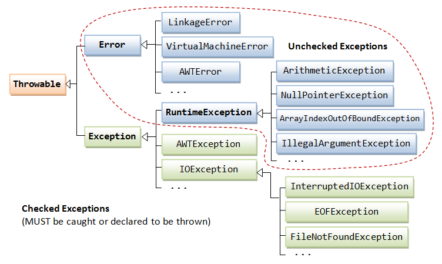

## Buổi 9: Xử lý ngoại lệ.
### 1. Các khái niệm liên quan.
- Exception: Exceptions là một sự kiện xảy ra khi một chương trình đang chạy (thực thi), sự kiện đó làm cho luồng xử lý thông thường của chương trình không thể thực hiện một cách bình thường, thậm chí chết chương trình.
- Cần phân biệt Exception với Error:
    - Error là các lỗi nghiêm trọng của chương trình.
    - Exception là lỗi chương trình được phát hiện và có thể xử lý.
- Phân loại exception:
    - Checked exception: là những exception phải xử lý ngay khi viết code, bởi nó được kiểm tra bởi chính trình biên dịch.
        - Ví dụ: ClassNotFoundException,...
    - Unchecked exception: là exception xảy ra khi chương trình chạy nghĩa là trình biên dịch không phát hiện ra biên dịch nên không thể xử lý khi viết code.
        - Ví dụ: NullPointerException, ArrayIndexOutOfBoundException,...
### 2. Xử lý exception.
1. **Xử lý ngoại lệ:**
    - Xử lý ngoại lệ trong Java là một cơ chế xử lý các lỗi runtime để có thể duy trì luồng hoạt động bình thường của ứng dụng.
    - Quá trình xử lý ngoại lệ được gọi là catch exception, nếu Runtime System không xử lý được ngoại lệ thì chương trình sẽ kết thúc.
1. **Quá trình xử lý của JVM:**
    - Khi một lỗi xảy ra trên một method, method đó sẽ tạo ra 1 object và đưa nó vào Runtime System (Object đó là Exception Object chứa tất cả thông tin về lỗi và trạng thái chương trình).
    - Runtime System sẽ tìm cách xử lý Exception phù hợp tại method ấy. Nếu không có thì sẽ tiếp tục tìm ở các method trên. Nếu không có method nào có xử lý ngoại lệ phù hợp thì Thread mà đang thực hiện chuỗi method xảy ra ngoại lệ bị ngắt. Nếu thread ấy là main thì ngắt chương trình.
1. **Xử lý ngoại lệ trong Java:**
    - Khối lệnh try trong java được sử dụng để chứa một đoạn code có thế xảy ra một ngoại lệ. Nó phải được khai báo trong phương thức.
    - Sau một khối lệnh try bạn phải khai báo khối lệnh catch hoặc finally hoặc cả hai.
1. **Sử dụng khối lệnh try, catch**
    - Cú pháp:
    ``` java
    try{
        // Khối lệnh có thể ném ra ngoại lệ.
    }catch(Exception_class_name ex){
        // code xử lý ngoại lệ.
    }final{
        // code trong này luôn được thực thi.
    }
    ```
    - Ví dụ:
    ``` Java
    public class Main {
        public static void main(String[] args) {
            int a[] = new int[5];
            try{
                System.out.println("Start");
                System.out.println(a[5]);
            }catch (ArrayIndexOutOfBoundsException e){
                System.out.println("Catch Block");
            }
        }
    }
    ```
    ```
    Output:
    Start
    Catch Block
    ```
1. **Khối lệnh finally**
    - Được sử dụng để thực thi các lệnh quan trọng như đóng kết nối,...
    - Khối lệnh finally trong java luôn được thực thi cho dù có ngoại lệ xảy ra hay không hoặc gặp lệnh return trong khối try.
    - Ví dụ:
    ```Java
    public class Main {
        public static void main(String[] args) {
            int a[] = new int[5];
            try{
                System.out.println(a[5]);
                
            }catch (ArrayIndexOutOfBoundsException e){
                System.out.println("Catch Block");
                return;
            }finally{
                System.out.println("Done");
            }
        }
    }
    ```
    ```
    Output:
    Catch Block
    Done
    ```
### 3. Cây phân cấp exception, từ khóa throw và throws.
1. Cây phân cấp exception:
    - Đặc điểm:
        - Class ở mức cao nhất là Throwable.
        - Hai class con trực tiếp là Error và Exception.
        - Trong nhánh Exception có nhánh con RunTimeException là ngoại lệ sẽ không được Java kiểm tra tại thời điểm biên dịch.
    
2. Từ khóa throw và throws.
    - Từ khóa throw:
        - Được sử dụng để ném ra một ngoại lệ cụ thể.
        - Chủ yếu được sử dụng để ném ra ngoại lệ tùy chỉnh.
        - Cú pháp:
        ```Java
            throw exception;
        ```
        Ví dụ:
    - Từ khóa throws:
        - Được sử dụng để khai báo ngoại lệ.
        - Thể hiện thông tin rằng có thể xảy ra một ngoại lệ trong một phương thức (ngoại lệ ở đây chủ yếu là checked exception).
        - Chủ yếu được sử dụng để xử lý ngoại lệ checked bởi vì ngoại lệ Unchecked đã trong tầm kiểm soát.
        - Cú pháp:
        ```Java
        return_type method_name() throws exception_class_name {
            // method code
        }
        ```
### 4. Custom exception.
- Custom exception là ngoại lệ do người dùng tự định nghĩa
- Thông thường, để tạo custom exception thuộc loại checked thì ta kế thừa lớp exception. Để tạo custom exception thuộc loại unchecked chúng ta kế thừa từ lớp RunTimeException.
- Ví dụ:
    - Custom Checked Exception:
    ```Java
    class InvalidAgeException extends Exception {
        InvalidAgeException(String s) {
            super(s);
        }
    }
    class CustomExceptionExample {
    
        static void validate(int age) throws InvalidAgeException {
            if (age < 18) {
                throw new InvalidAgeException("not valid");
            } else {
                System.out.println("welcome to vote");
            }
        }
    
        public static void main(String args[]) {
            try {
                validate(13);
            } catch (Exception m) {
                System.out.println("Exception occured: " + m);
            }
    
            System.out.println("rest of the code...");
        }
    }
    ```
    - Custom UnChecked Exception
    ```Java
    class InvalidAgeException extends RuntimeException {
        InvalidAgeException(String s) {
            super(s);
        }
    }
    class CustomExceptionExample {
    
        static void validate(int age) {
            if (age < 18) {
                throw new InvalidAgeException("not valid");
            } else {
                System.out.println("welcome to vote");
            }
        }
    
        public static void main(String args[]) {
            try {
                validate(13);
            } catch (Exception m) {
                System.out.println("Exception occured: " + m);
            }
    
            System.out.println("rest of the code...");
        }
    }
    ```


